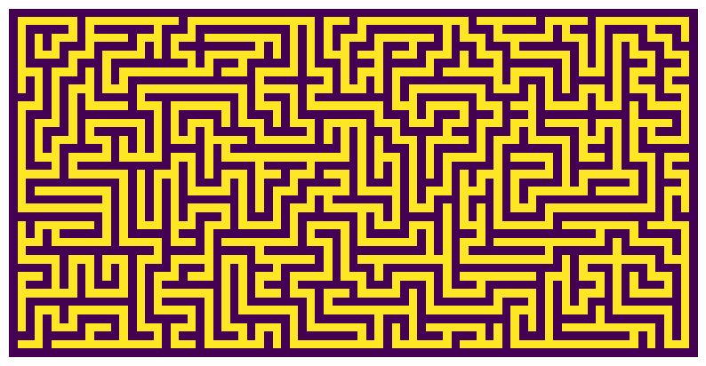

`mymaze` is a maze generator, solver and plotter. It uses the [randomized depth-first search](https://en.wikipedia.org/wiki/Maze_generation_algorithm#Randomized_depth-first_search) algorithm to generate the maze and [breadth-first search](https://en.wikipedia.org/wiki/Breadth-first_search) to find the shortest path from start to goal.

<p align="center">


</p>

Example usage
-------------
```python
from maze import Maze
maze = Maze(40, 20)
maze.solve()
maze.plot()
```
